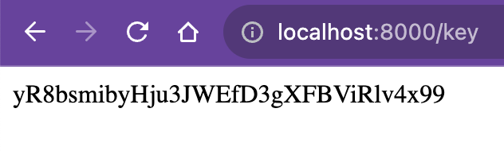

# Instalasi LumenAPI, MongoDB, dan Konfigurasi APP Key

* ## Percobaan Instalasi Composer
    Instalasi composer khususnya pada arsitketur M1 (Apple Silicon) bisa dilakukan dengan mengakses link https://getcomposer.org/doc/00-intro.md 

    Lalu setelah mengakses link tersebut, gunakan command 
    > *mv composer.phar /usr/local/bin/composer* 

    Namun pada tahap ini, composer telah terinstall sehingga langkah ini dilewati.  
     

    * ## Percobaan Instalasi MongoDB Server dan MongoDB Compass
    * ### Instalasi MongoDB Server
    Instalasi MongoDB pada arsitektur M1 bisa dilakukan dengan mengakses link https://www.mongodb.com/docs/manual/tutorial/install-mongodb-on-os-x/  atau bisa dilakukan lewat terminal dengan menggunakan command sebagai berikut : 
    1. >xcode-select --install

    
    Jika sudah terinstall, makan akan ada tulisan seperti gambar diatas. 

    2. >brew tap mongodb/brew
    
    Untuk mengunduh Homebrew Formula untuk MongoDB dan database tools. 

    3. >brew update

    Untuk mengupdate homebrew

    4. >brew install mongodb-community@7.0

    Lalu untuk menginstall mongoDB via homebrew, bisa menggunakan commad diatas.

    

    5. >brew services start mongodb-community@7.0

    Lalu untuk memulai server mongoDB, bisa menggunakan command diatas.

    

    Pada gambar tersebut, server mongoDB berhasil dijalankan.

    * ### Instalasi MongoDB Compass
    Untuk menginstal GUI dari mongoDB, kita bisa menggunakan aplikasi MongoDB Compass. Tahapannya yaitu :  
    1. Buka website MongoDB atau bisa melalui link https://www.mongodb.com/try/download/shell  
    2. Lalu pilih versi dan platform yang sesuai dengan device kalian.
    
     
    disini saya menggunakan platform MacOS M1 dengan versi 1.10.6 lalu klik *download*
    3. Setelah Download, lalu ekstrak dan jalankan aplikasi MongoDB compass
    4. Lalu Mongodb Compass berhasil dijalankan.
    

    * ## Percobaan Instalasi Lumen
    Untuk menginstal lumen, kita dapat menggunakan visual studio code. Untuk cara yaitu :  
    1. Buat Folder terlebih dahulu dengan menggunakan command
        >mkdir tesLumenAPI

        

    2. Setelah membuat folder, kita masuk kedalam folder lalu kita menginstal lumen dengan menggunakan command 
        >composer create-project --prefer-dist laravel/lumen lumenapi

        

    3.  Setelah itu, buka Visual Studio Code, lalu buka folder lumenAPI yang sudah terinstal.
        

    4. Lalu, buka folder routes dan kemudian buka file web.php lalu masukan syntax berikut kedalam file web.php
        >$router->get('/key', function () {  
    return Str::random(32);  
});

        

    5. Setelah itu, jalankan terminal pada Visual Studio Code lalu gunakan command dibawah ini untuk menjalankan server.
        >php -S localhost:8000 -t public

        

    6. Untuk mengetahui apakah lumen berhasil di instal atau tidak, jalankan "http://localhost:8000" pada browser
        

    7. Untuk mendapatkan appKey, jalanka "http://localhost:8000/key"
        

    8. Setelah mendapatkan appKey, maka instalasi lumen dan konfigurasi appKey berhasil di jalankan.

